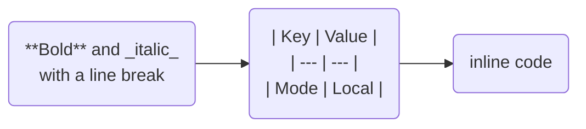

# Merhmaid Renderer

A browser-based renderer for [Mermaid](https://mermaid.js.org) diagrams whose
**double-quoted node labels are full Markdown** — inspired by
[Obsidian Mehrmaid](https://github.com/huterguier/obsidian-mehrmaid).

Paste a diagram, edit it with a live preview, and export a pixel-perfect SVG or
high-resolution PNG. Everything runs locally in the browser: there is no
backend, no upload and no account.

<p align="center">
  <em>flowchart · markdown labels · tables · code blocks · lists · links</em>
</p>

## Features

**Rendering**

- Bundles Mermaid 11 (no CDN, works offline once loaded)
- Double-quoted node labels are rendered as GitHub-flavoured Markdown:
  headings, bold/italic, lists, task lists, tables, code, block quotes, links,
  images and inline HTML
- Markdown also works inside `subgraph "titles"` (optional)
- Every node shape is supported: `[square]`, `(round)`, `{diamond}`,
  `>asymmetric]`, `[/parallelogram/]`, `[\trapezoid\]`, `((circle))`,
  `{{hexagon}}`, `[(cylinder)]`
- Any other Mermaid diagram type (sequence, class, state, ER, gantt, pie, …)
  renders untouched — plain text is never rewritten
- Five Mermaid themes plus a hand-drawn (sketchy) style, four connector styles
  and a direction override (`TB`/`BT`/`LR`/`RL`)
- Syntax errors keep the last good render on screen and report the exact source
  line (including a "Go to line" button)

**Export**

- **SVG** — the label stylesheet is embedded, so the file looks identical
  everywhere it is opened
- **PNG** — 1×–4× resolution, transparent background, remote images inlined as
  data URLs so rasterisation cannot be blocked by CORS
- Copy the image or the markup to the clipboard, download the `.mmd` source, or
  share the whole diagram as a URL (the diagram is encoded in the fragment —
  nothing is uploaded)

**Interface** (shadcn/ui + Tailwind v4)

- Split pane editor/preview with a draggable divider, or tabs on mobile
- Code editor with line numbers, active-line highlight, auto-indent and
  optional word wrap
- Zoom, pan, fit-to-view and fullscreen preview
- Light / dark / system theme, with the diagram theme following along
- Example gallery covering flowcharts, subgraphs, sequence, state, class and
  gantt diagrams
- Settings, undoable example loading, keyboard shortcuts, toasts
- The current document and settings are restored on reload

## Keyboard shortcuts

| Shortcut | Action |
| --- | --- |
| `Ctrl`/`Cmd` + `Enter` | Render now |
| `Ctrl`/`Cmd` + `S` | Download SVG |
| `Ctrl`/`Cmd` + `Shift` + `S` | Download PNG |
| `Ctrl`/`Cmd` + scroll | Zoom the preview |
| Double click the preview | Toggle fit / 100 % |
| `Tab` / `Enter` | Indent, or keep the current indentation |

## Getting started

```bash
npm install
npm run dev          # http://localhost:5173
```

Other scripts:

```bash
npm run build        # type check + production build into dist/
npm run preview      # serve the production build
npm run typecheck    # TypeScript only
npm test             # unit tests (vitest)
npm run test:e2e     # end-to-end tests (Playwright, builds first)
```

The first `npm run test:e2e` may need the browser binary:

```bash
npx playwright install chromium
```

## Writing Markdown labels

Only **double-quoted** labels are treated as Markdown, which is what keeps every
other diagram type safe:



- Labels may span multiple lines.
- Use `\n` for a hard line break inside a single line.
- Subgraph titles work too: `subgraph "**Build** steps"`.
- Turn the feature off in *Settings → Markdown labels* to render labels
  verbatim (useful when pasting a diagram that uses `"` for something else).

The rendered label is sanitised with DOMPurify, and Mermaid itself runs with
`securityLevel: "antiscript"`.

## How it works

1. **Extract** (`src/lib/mehrmaid.ts`) — a small scanner walks the source and
   collects quoted node labels (and optionally subgraph titles). Comments,
   `click` URLs, edge labels and other diagram types are ignored.
2. **Measure** (`src/lib/label.ts`) — each label is rendered as sanitised
   Markdown off-screen and measured, then the source is rewritten with
   fixed-size `<span>` placeholders. That size is what Mermaid lays out.
3. **Render** (`src/lib/render-diagram.ts`) — Mermaid is loaded lazily
   (`import("mermaid")`) and renders the placeholder source. The Markdown HTML
   is then dropped into the placeholders inside the SVG.
4. **Export** (`src/lib/export.ts`) — the SVG is cloned and the label stylesheet
   is embedded, so preview and export match exactly. PNG rasterisation encodes
   the SVG as a `data:` URL (a `blob:` URL taints the canvas in Chromium) after
   inlining any remote images.

Mermaid wraps HTML labels in `display: table-cell; white-space: nowrap` with
`max-width: flowchart.wrappingWidth`, so the placeholder is an `inline-block`
element with an explicit pixel size and `wrappingWidth` is always kept wider
than the label cap. That is what makes the preview and the export identical.

## Runtime dependencies

| Package | Purpose |
| --- | --- |
| `mermaid` | Diagram rendering (lazy-loaded, bundled) |
| `marked` | Markdown → HTML for labels |
| `dompurify` | Sanitising rendered label HTML |
| `react`, `react-dom` | UI |
| `radix-ui`, `lucide-react`, `sonner`, … | shadcn/ui component stack |
| `tailwindcss` | Styling |

## Deployment

`npm run build` produces a fully static `dist/` folder that can be hosted
anywhere (GitHub Pages, Netlify, S3, a homelab nginx, …). Assets use relative
paths, so the build works from a sub-path such as
`https://<user>.github.io/merhmaid-renderer/` without extra configuration. It
does need to be served over HTTP, though: ES modules cannot be loaded from a
`file://` URL.

The included workflows run the type check, unit tests, build and end-to-end
tests on every push/PR, and deploy `dist/` to GitHub Pages from `main` (enable
*Settings → Pages → Source: GitHub Actions* once).

## Limitations

- Markdown labels apply to flowcharts (nodes and, optionally, subgraph titles).
  Edge labels (`A -- "text" --> B`) are intentionally left as plain text.
- PNG export of labels containing remote images depends on the image host
  allowing CORS; when it does not, the image is skipped and a warning is shown.
  SVG export always keeps the original image URLs.
- KaTeX math (`$$…$$`) is rendered by Mermaid's own KaTeX support, but the
  KaTeX fonts are not embedded in exported files.

## Licence

MIT
